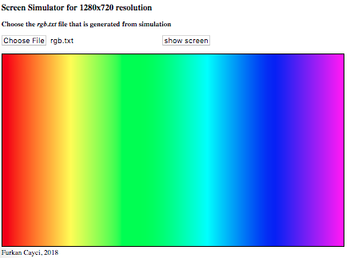
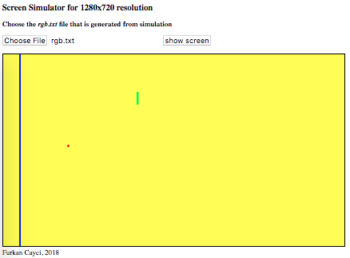

# vhdl-display-simulator

Screen Display Simulator written in VHDL and JS. Generates RGB pixel data from VHDL simulation and displays the pixels on the browser. Currently only supports 720p resolution (1280x720) and 24-bit RGB data. 

Written for FPGA class to quickly tinker with object buffer to pass to HDMI.
Example output for `pattern_generator.vhd` and `objectbuffer.vhd` are shown below.

 

## Procedure

### Using ISIM

1. create a project and import files in the `rtl` directory. 
2. add the testbench from `sim` directory and run the testbench. `rgb.txt` data should be generated under `debug` folder. This will take a couple seconds and will take around ~10MB space.
3. open `display.html` from `impl` folder in your browser, load `rgb.txt` data and hit `show screen` button.

### Using GHDL

NOTE: Windows support is not added yet.

0. Install GHDL and add it to your path.
1. run `make` to check VHDL syntax in your code
2. run `make simulate` to create the RGB data. This runs the `tb_display.vhd` testbench for one full frame. It stores pixel color data per clock when in the active video area. Saves in a file called `rgb.txt` stored under `debug` folder. This will take a couple seconds and will take around ~10MB space.
3. open `display.html` from `impl` folder in your browser, load `rgb.txt` data and hit `show screen` button.

## Files

```
+- makefile                : GHDL simulation / RGB data generation
+- rtl/
| -- timing_generator.vhd  : timing generator
| -- pattern_generator.vhd : color spectrum pattern
| -- objectbuffer.vhd      : generates objects
+- sim/
| -- tb_display.vhd            : runs for one full frame, and generates rgb values for each pixel
+- impl/
| -- display.html              : HTML / JS code to display the generated rgb data
```
